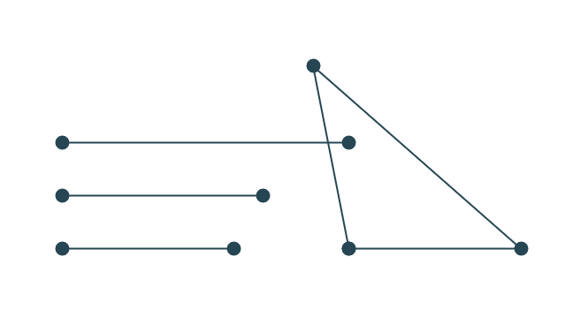
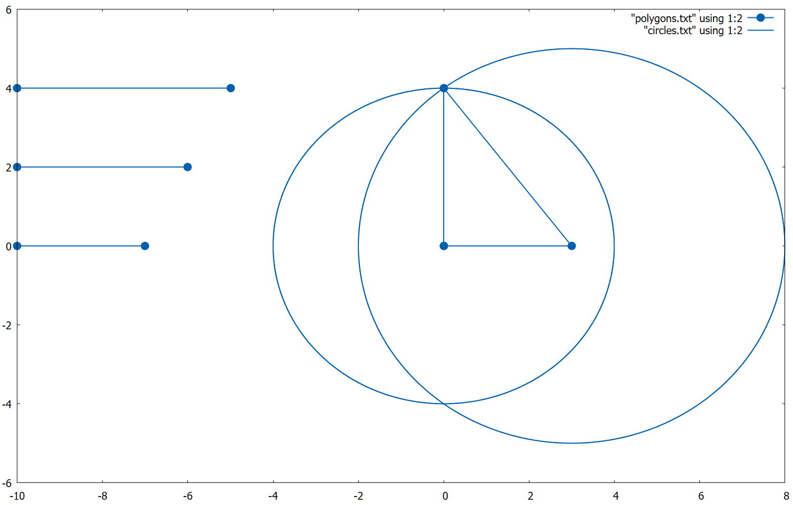

# Евклидова геометрия в C++

Реализованы классы вектора, отрезка, точки, окружности и многоугольника.

Реализована возможность построения теругольника по трем сторонам:





## Как запустить?

1. Зайти в директорию с `Makefile`
2. Запустить команду ```make```
3. Запустить `prog`

При запуске выполняется тестирование функции пересечения окружностей и построение треугольника (длины сторон задаются в файле `side.txt`) [^1].

Чтобы отобразить построенный треугольник можно запустить `gnuplot` и написать команду:

```
plot "polygons.txt" using 1:2 with linespoints
```

## Как красиво строить в `gnuplot`?

[тык](https://mech-math-msu.github.io/3-semester/programming/publish/gnuplot.html)

[^1]: Никаких проверок на корректность данных в файле не выполняется.
